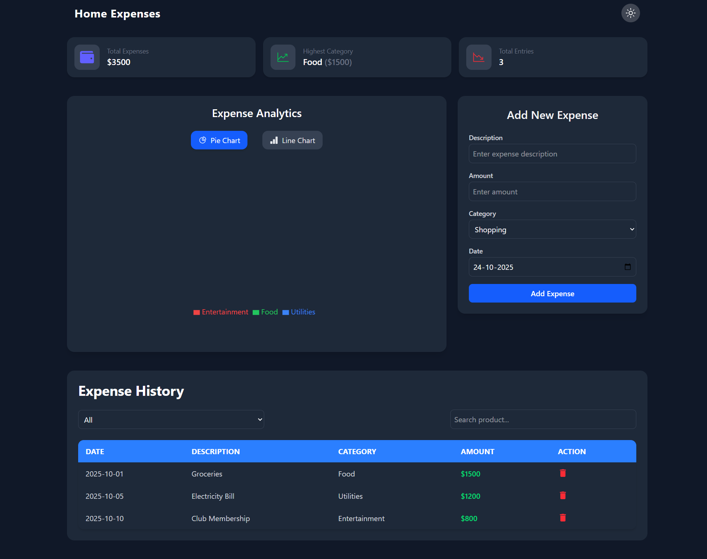

# 💰 Expense Tracker

A modern and interactive **Expense Tracker Web App** built using **React** and **Tailwind CSS**, designed to help you easily track your daily expenses, analyze spending habits, and manage your budget efficiently.

---

## ✨ Features

- 🧾 **Add Daily Expenses** – Effortlessly add and categorize your daily expenses.
- 📊 **Pie Chart Visualization** – Get a visual breakdown of your spending by category.
- 💵 **Total Expense Overview** – See your total expenditure at a glance on the top tab.
- 🏷️ **Highest Spending Category** – Instantly view which category you spend the most on.
- 📦 **Total Items Tab** – Displays total number of expense entries you’ve added.
- 🌗 **Responsive & Modern UI** – Built with Tailwind CSS for a clean and responsive design.

---

## 🖼️ Screenshots

### 🏠 Dashboard View



## 🛠️ Tech Stack

- ⚛️ **React.js** – Frontend library
- 🎨 **Tailwind CSS** – Styling and layout
- 📈 **Chart.js / Recharts** – For Pie chart visualization
- 💾 **Local Storage / Context API** – For managing expense data

---

## 🚀 How to Run Locally

1. **Clone the repository**
   ```bash
   git clone https://github.com/Mohd-Affan-Code/Expense-Tracker.git
   ```
